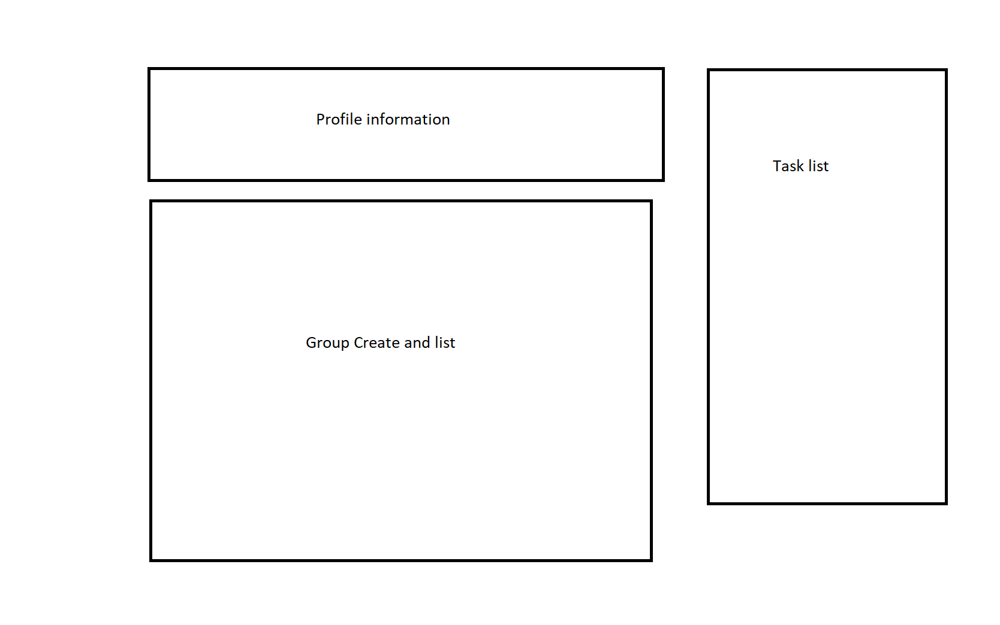

# Task Manager App

## Project Goals

I want to create a task management APP. USERS Can Share tasks with other users.
Feature List:
-BASIC 
    -CREATE A TASK THAT CAN be EDITED AND Deleted. 
    Set task Deadline,
-Additional features
    -Set task from SET-→ in Progress → done 
    -Allow different roles in tasks 
    -Group Users as "project" and set multiple tasks
    -Assign tasks to people 
    -When task updated, group informed

The live link can be found here - https://task-todo-frontend.herokuapp.com


## Features

### Existing Features

- Landing Page

- Create Task

- List Tasks
    

- Create Groups
  
- Groups List
   
- ProfilePage
 
### Future Features


## Data Model

### Profiles

- This authenitication uses the default django user model.
- There is one form in this app which allows users to fill in the fields for the user model.
- There are three views associated with the authenitication app:
    - login_user takes the post from login.html and authenticates the username and password submited.
    if the user exists then the user is redirected to their user-panel, otherwise they are redirected back to the login page.
    - logout_user calls the logout function and redirects the user to the landing page.
    - register_user takes the post from RegisterUserForm form and checks if the form is valid then if successful it also calls the log in user function and redirects the user to the landing page

### Tasks

- 
## Groups


### UX Design

- Early layout designs
    - This is the layout of the landing page which shows How I wanted this page to look. 
    
    - With the task page layout I knew I would have to have a component for creating and displaying Todos.
    
    - With the profile Page design I knew I wanted the Todo's to be listed here again so I would reuse that component. I also needed to create components for group creation and viewing.
    
## Testing

### Validator Testing

- Html
    - Using w3 validator templates were passing ignoring Django html template syntax
    - https://validator.w3.org/nu/

- Python
    - Passed pycodestyle formatting

### Compatibility Testing

Site was tested across multiple virtual devices through chrome developor tools.

Site was tested to work on Google chrome, firefox, microsoft edge and internet explorer.

### Manual Testing

#### Booking

```

class BookUrlTests(TestCase):

    def test_get_home(self):
        response = self.client.get('/')
        self.assertEqual(response.status_code, 200)
        response2 = self.client.get(reverse('index'))
        self.assertEqual(response2.status_code, 200)
        self.assertTemplateUsed(response, 'index.html', 'layout.html')

    def test_get_contact_us(self):
        response = self.client.get('/contact-us')
        self.assertEqual(response.status_code, 200)
        response2 = self.client.get(reverse('contact-us'))
        self.assertEqual(response2.status_code, 200)
        self.assertTemplateUsed(response, 'contact.html', 'layout.html')

    def test_get_booking(self):
        response = self.client.get('/booking')
        self.assertEqual(response.status_code, 200)
        response2 = self.client.get(reverse('booking'))
        self.assertEqual(response2.status_code, 200)
        self.assertTemplateUsed(response, 'booking.html', 'layout.html')

    def test_get_booking_submit(self):
        response = self.client.get('/booking-submit')
        self.assertEqual(response.status_code, 200)
        response2 = self.client.get(reverse('bookingSubmit'))
        self.assertEqual(response2.status_code, 200)
        self.assertTemplateUsed(response, 'bookingSubmit.html', 'layout.html')

    def test_get_staff_panel(self):
        response = self.client.get('/staff-panel')
        self.assertEqual(response.status_code, 200)
        response2 = self.client.get(reverse('staffPanel'))
        self.assertEqual(response2.status_code, 200)
        self.assertTemplateUsed(response, 'staffPanel.html', 'layout.html')

    #login required pages
    def test_get_user_panel(self):
        test_user = User.objects.create_user(username='testuser', password='AGoodPassword')
        login = self.client.login(username='testuser', password='AGoodPassword')
        response = self.client.get('/user-panel')
        self.assertEqual(str(response.context['user']), 'testuser')
        self.assertEqual(response.status_code, 200)
        response2 = self.client.get(reverse('userPanel'))
        self.assertEqual(response2.status_code, 200)
        self.assertTemplateUsed(response, 'userPanel.html', 'layout.html')

```

#### Authentication

```
class TestRegisterUserForm(TestCase):

    def setUp(self) -> None:
        self.username = 'testuser'
        self.first_name = 'test'
        self.last_name = 'user'
        self.email = 'testuser@email.com'
        self.password = 'AGoodPassword'

    def test_registration_form(self):
        invalid_data_dicts = [
            # Non-alphanumeric username.
            {
              'data':
              {'username': 'foo/bar',
               'email': 'tests@example.com',
               'password1': '12345678',
               'password2': '12345678'},
            },
            # Non-valid email.
            {
              'data':
              {'username': 'user',
               'email': 'notanemail',
               'first_name': 'user',
               'last_name': 'test',
               'password1': 'AGoodPassword',
               'password2': 'AGoodPassword', },
            },
            # Empty username.
            {
              'data':
              {'username': '',
               'email': 'tests@example.com',
               'first_name': 'user',
               'last_name': 'test',
               'password1': 'AGoodPassword',
               'password2': 'AGoodPassword', },
            },
            # Empty first name.
            {
              'data':
              {'username': 'user',
               'email': 'tests@example.com',
               'first_name': '',
               'last_name': 'test',
               'password1': 'AGoodPassword',
               'password2': 'AGoodPassword', },
            },
            # Empty last name.
            {
              'data':
              {'username': 'user',
               'email': 'tests@example.com',
               'first_name': 'user',
               'last_name': '',
               'password1': 'AGoodPassword',
               'password2': 'AGoodPassword', },
            },
            # Bad Password.
            {
              'data':
              {'username': 'user',
               'email': 'tests@example.com',
               'first_name': 'user',
               'last_name': 'test',
               'password1': 'Password',
               'password2': 'Password', },
            },
            # Empty email.
            {
              'data':
              {'username': 'user',
               'email': '',
               'first_name': 'user',
               'last_name': 'test',
               'password1': 'AGoodPassword',
               'password2': 'AGoodPassword', },
            },
            # passwords not-matching.
            {
              'data':
              {'username': 'user',
               'email': 'tests@example.com',
               'first_name': 'user',
               'last_name': 'test',
               'password1': 'AGoodPassword',
               'password2': 'ABadPassword', },
            },
        ]

        for invalid_dict in invalid_data_dicts:
            form = forms.RegisterUserForm(data=invalid_dict['data'])
            self.failIf(form.is_valid())

        form = forms.RegisterUserForm(data={'username': 'user',
                                            'email': 'tests@example.com',
                                            'first_name': 'user',
                                            'last_name': 'test',
                                            'password1': 'AGoodPassword',
                                            'password2': 'AGoodPassword', })
        self.assertTrue(form.is_valid())
    
class LogInTest(TestCase):
    
  def test_get_home(self):
    response = self.client.get('/')
    self.assertEqual(response.status_code, 200)
    self.assertTemplateUsed(response, 'index.html', 'layout.html')

  def test_get_login(self):
    response = self.client.get('/user/login_user')
    self.assertEqual(response.status_code, 200)
    self.assertTemplateUsed(response, 'registration/login.html', 'layout.html')

  def test_get_registration(self):
    response = self.client.get('/user/register_user')
    self.assertEqual(response.status_code, 200)
    self.assertTemplateUsed(response, 'register_user.html', 'layout.html')

```

## Deployment

- The site was deployed using Code Institute's mock terminal for Heorku. The steps to deploy are as follows
    - Create a new Heroku App
    - Set the buildbacks to Python and NodeJS in that order
    - Link the heroku app to a PostgreSQL database hosted on https://www.elephantsql.com
    - Link the heroku app to the repository
    - Click on Deploy

## Credits

- To complete this project I used Code Institute student template: [gitpod full template](https://github.com/Code-Institute-Org/python-essentials-template)

- Bootstrap framework was used to help write the html and css in the templates.

### Code

- Tutorials I followed to create the basis of this code are as follows:
    -https://www.youtube.com/watch?v=W9BjUoot2Eo 

